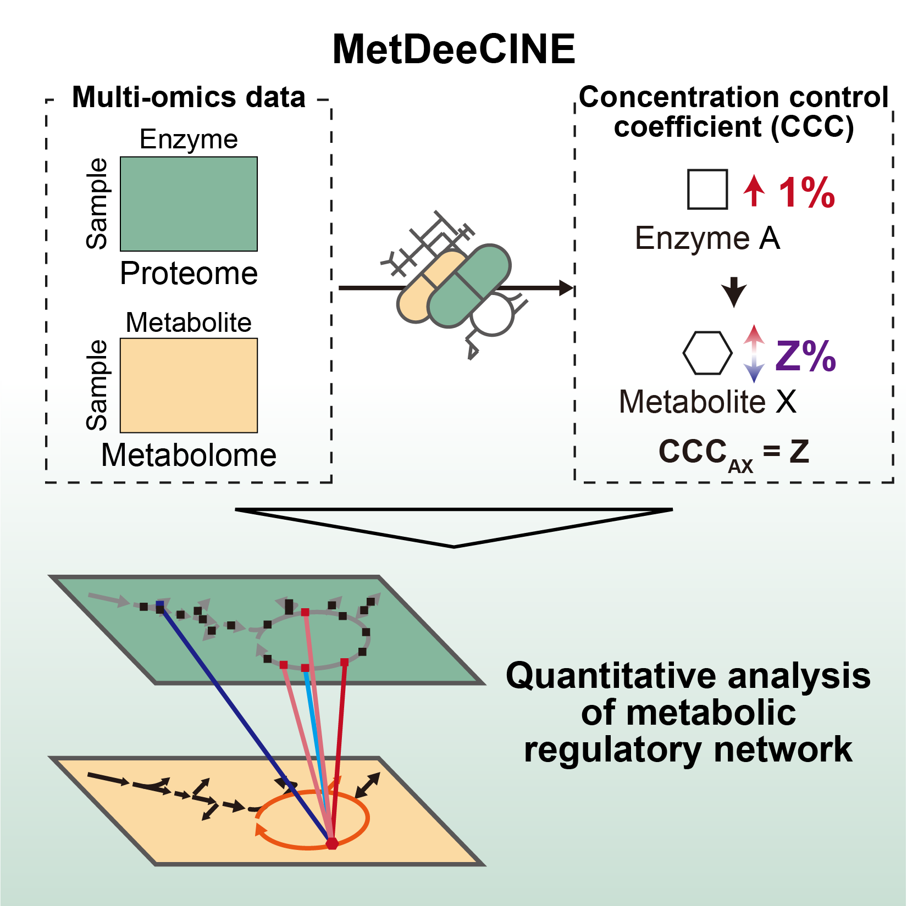

# MetDeeCINE: Multi-omics integration for quantitative analysis of metabolism


MetDeeCINE is an explainable deep learning framework designed to learn the principles of metabolic control from multi-omics data. It integrates foundational stoichiometric knowledge into a graph neural network (GNN) to predict quantitative relationships between enzymes and metabolites.

## Overview
Understanding the complex regulatory networks of metabolism is a major challenge in systems biology. Traditional approaches face a trade-off between the mechanistic detail of kinetic models, which are difficult to scale, and the scalability of statistical methods that often lack biological interpretability.

MetDeeCINE bridges this long-standing gap by introducing a data-driven, mechanism-informed paradigm. Its core is a **Metabolism-informed Graph Neural Network (MiGNN)**, which uses the known structure of metabolic reactions (stoichiometry) to guide the learning process from proteome and metabolome data. This approach improves predictive performance and ensures that the model's inferences are biologically interpretable.

The primary output of MetDeeCINE is the prediction of **Concentration Control Coefficients (CCCs)**, which quantify how a change in the activity of a single enzyme affects the concentration of each metabolite across the entire network.

### Key Features

By integrating multi-omics data with network structure, MetDeeCINE can:

* **Predict quantitative metabolic control:** Accurately estimate CCCs from proteome and metabolome data without requiring detailed kinetic parameters.
* **Learn "beyond stoichiometry":** Capture complex regulatory phenomena, such as long-range allosteric effects, that are not explicitly encoded in the input network structure.
* **Deconvolute complex signals:** Pinpoint the specific enzymes driving metabolic changes in disease states, even when multiple enzymes change simultaneously.
* **Achieve omics-scale analysis:** Scale to large datasets to reveal system-level principles of metabolic organization, such as the differential regulation of central carbon metabolism versus biosynthetic pathways.



## Prerequisites
The software is tested in Linux environment (Red Hat Enterprise Linux 9.4, CUDA 12.8, HPC environment) and Google Colab environment (Python 3.11.13, GPU T4).
The basic requirements for running MetDeeCINE are Python with the following packages:

- python=3.11.4
- torch==2.0.1
- scikit-learn==1.3.0
- scipy==1.11.1
- optuna==3.3.0
- pandas==2.0.3
- numpy==1.23.5
- matplotlib==3.7.2
- seaborn==0.12.2

Details on system requirements and full dependency list are contained in the following file: environment.yml

## Installation

1. Clone this repository:
```bash
git clone https://github.com/shimizu-team/metdeecine.git
cd metdeecine
```
2. Construct environment:

You can set up the required environment using the `environment.yml` file:

```bash
conda env create -f environment.yml
conda activate MetDeeCINE
```

## Usage
### Quick Start
The simplest way to use MetDeeCINE is through the provided Jupyter notebook tutorial (`tutorial.ipynb`).
We offer similar ipynb which can be run on Google Colab: [](https://colab.research.google.com/github/Shimizu-team/metdeecine/blob/main/colab_demo.ipynb)

Expected runtime: ~3-5 minutes including installation

### Input Files

To run MetDeeCINE, you need to prepare your input files in a specific format and place them in the `input` directory.

1.  **Create Data Directories**:
    Create a directory named `input` at the root of the project. Inside it, create a new directory for your dataset (e.g., `./input/MyDataset/`).

2.  **Measurement Data (CSV)**:

      * Place a CSV file for each experimental condition (e.g., wild-type, mutant) inside your dataset directory.
      * **Filename**: The filenames must start with `tbl` (e.g., `tbl_wildtype.csv`), as they are recognized by `preprocessing_new.py`.
      * **Format**:
          * The header of the first column must be `KEGG IDs`[cite: 3].
          * Each row represents a specific enzyme or metabolite, identified by its KEGG ID.
          * Each subsequent column represents an individual sample.
          * The values are the measured quantities, such as concentrations.
    
    **Example: `tbl_wildtype.csv`**
    ```csv
    KEGG IDs,Sample1,Sample2,Sample3
    C00022,1.23,1.25,1.20
    C00031,2.01,2.05,1.98
    K00844,0.55,0.53,0.56
    ...
    ```

3.  **Stoichiometry File (`stoichiometry.txt`)**:

      * This file provides the model with the structure of the metabolic network, containing information about enzymes and their associated substrates and products. You can create this file using KEGG reaction database or other sources.
      * Place a file named `stoichiometry.txt` in your dataset directory.
      * **Format**: Each line represents a single enzymatic reaction, written as `EnzymeID: Substrates/Products`. Substrates and products are separated by spaces.
    **Example: `stoichiometry.txt`**
    ```
    K00844:C00022 C00003 C00024 C00004
    K01647:C00031 C00003 C00035 C00004
    ...
    ```

### MetDeeCINE Workflow

The execution flow of MetDeeCINE, as demonstrated in `tutorial.ipynb`, proceeds through the following steps.

#### Step 1: Configuration Setup
  * Open the `src/config.py` file and edit the settings to match your project. Key parameters to configure include:
      * `exp_name`: The path to your input data.
      * `exp_strains`: A comma-separated list of your experimental conditions (corresponding to the CSV files).
      * **Model Hyperparameters**: `GNN_numlayer`, `lr`, `loss_fn`, etc.. Default values are optimized for the paper's dataset and may need adjustment.
#### Step 2: Initialization and Preprocessing
  * Instantiate the `MetDeeCINE` class, passing the `config` object.
    ```python
    from metdeecine import MetDeeCINE
    from config import config

    conf = config()
    metdeecine = MetDeeCINE(conf)
    ```
  * Execute the `data_preprocessing()` method. This step performs the following actions:
      * Calculates the fold changes (FCs) between samples from the input CSV files.
      * Splits the data into training and validation sets and creates PyTorch `DataLoader` objects.
      * Constructs the enzyme-metabolite and metabolite-metabolite adjacency matrices from `stoichiometry.txt`.
      * Prepares a dictionary of settings required for model training and inference.
    <!-- end list -->
    ```python
    train_loader_list, val_loader_list, train_loader_all, inference_input, model_settings = metdeecine.data_preprocessing()
    ```

#### Step 3: Hyperparameter Tuning (Optional)

  * **Optional**: Run the `hyperparameter_tuning()` method to automatically optimize model hyperparameters using Optuna.
      * This step uses Bayesian optimization to find the best combination of hyperparameters such as learning rate, loss function, activation function, and GNN-specific parameters.
      * The optimization is performed using cross-validation on the training data.
      * **Important**: If you perform hyperparameter tuning, you must reload the configuration and reinitialize MetDeeCINE with the optimized parameters before proceeding to model training.
    <!-- end list -->
    ```python
    # Optional: Hyperparameter tuning using Optuna
    best_params = metdeecine.hyperparameter_tuning(train_loader_list, val_loader_list, output_dir)
    print("Best hyperparameters:", best_params)
    
    # IMPORTANT: If hyperparameter tuning was performed, you must update the config
    # and reinitialize MetDeeCINE with the optimized parameters
    if best_params:
        # Update config with best parameters
        for param_name, param_value in best_params.items():
            setattr(conf, param_name, param_value)
        
        # Reinitialize MetDeeCINE and rerun preprocessing
        metdeecine = MetDeeCINE(conf)
        train_loader_list, val_loader_list, train_loader_all, inference_input, model_settings = metdeecine.data_preprocessing()
    ```

#### Step 4: Model Training

  * Run the `fc_training()` method to train the MiGNN model.
      * Internally, this function performs training and evaluation based on the specified `CV_method` (cross-validation), as handled in `train.py` (`run_training_cv`).
      * After determining the optimal number of epochs, the model is retrained on the entire dataset, and the resulting weights are saved.
    <!-- end list -->
    ```python
    # The trained model parameters will be saved to the specified path
    parameter_save_path = output_dir + 'model_params.pth'
    metdeecine.fc_training(model_settings, train_loader_list, val_loader_list, train_loader_all, parameter_save_path)
    ```

#### Step 5: CCC Inference
  * Call the `ccc_inference()` method to infer the Concentration Control Coefficients (CCCs) using the trained model.
      * This loads the trained model weights (e.g., from `model_params.pth`).
      * It feeds vectors, which only one enzyme is logFC and all other dimensions are set to zero, into the model to predict changes in metabolite FCs.
      * The CCC matrix is calculated from these predictions and saved as a CSV file.
    <!-- end list -->
    ```python
    # Use pre-trained weights or the weights from Step 3 for inference
    parameter_load_path = './input/Uematsu_2022/pretrained_weight.pth' 
    metdeecine.ccc_inference(model_settings, inference_input, output_dir, parameter_load_path)
    ```

### Output Explanation
Upon successful execution, a timestamped directory (e.g., `results/YYYYMMDD_HHMMSS/`) will be created, containing the following files:

  * **`config.py`**
      * A copy of the configuration file used for the run. This is saved to ensure reproducibility by documenting the exact parameters used.

  * **`model_params.pth`**
      * A PyTorch file containing the saved weights and biases of the trained MiGNN model. This file is loaded during the `ccc_inference` step and can be reused for future predictions.

  * **`meanCCC.csv`**
      * This is the **main output** of MetDeeCINE. It contains the inferred Concentration Control Coefficient (CCC) matrix.
      * **Rows**: KEGG IDs of enzymes.
      * **Columns**: KEGG IDs of metabolites.
      * **Values**: The CCC value, which quantifies the effect of a change in an enzyme's activity (row) on the concentration of a metabolite (column).
          * **Positive value**: Suggests that an increase in the enzyme leads to an increase in the metabolite's concentration.
          * **Negative value**: Suggests that an increase in the enzyme leads to a decrease in the metabolite's concentration.
          * **Magnitude**: The absolute value indicates the strength of the influence. A larger absolute value means the enzyme has a stronger regulatory effect on the metabolite's concentration.

#### Additional Files (when Hyperparameter Tuning is performed)

  * **`optuna_study.db`**
      * SQLite database file containing the complete Optuna study results.
      * Stores all trial information, hyperparameter combinations, and their corresponding performance metrics.
      * Can be loaded in future runs using `conf.load_trial_path` to continue optimization from where it left off.

  * **`optuna_study.csv`**
      * CSV file containing a summary of all trials performed during hyperparameter optimization.
      * Includes columns for each hyperparameter tested and the resulting performance metric.
      * Useful for analyzing the relationship between hyperparameters and model performance and identifying trends in the optimization process.

## Directory Structure
```
MetDEECINE/
├── src/ - Source code
│   ├── config.py - Configuration
│   ├── create_dics.py - Create dictionaries for MetDeeCINE settings
│   ├── hyperparameter_tuning.py - Hyperparameter tuning with Optuna
│   ├── metdeecine.py - Main MetDeeCINE class
│   ├── mignn.py - Machine learning model class
│   ├── preprocessing.py - Data preprocessing
│   └── train.py - Training class
├── input/ - Input directory
│   ├── Uematsu_2022/ - Sample data
│       ├── stoichiometric_file - Stoichiometric information on measured enzymes
│       ├── csv_files - proteome and metabolome data in csv format (Separated with each experimental condition)
├── results/ - Results directory
├── tutorial.ipynb - Tutorial notebook
└── envorionment.yml - Conda environment configuration file
```

## License
This project is licensed under the MIT License. See the LICENSE file for details.